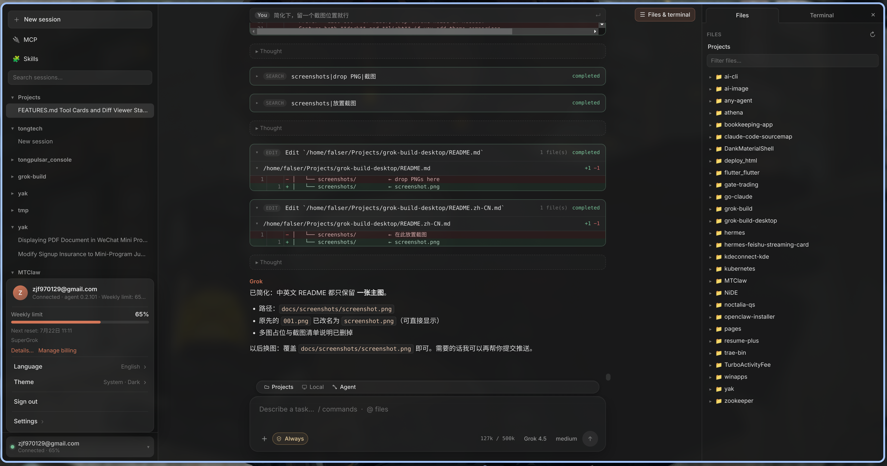

# Grok Build Desktop

> [English](./README.md) | 简体中文

**[Grok Build](https://x.ai/cli) 的 Electron 桌面客户端** — Claude Desktop 风格界面，底层复用与 CLI / TUI 相同的 Rust Agent。

```text
Electron UI  →  ACP / JSON-RPC  →  grok agent serve （本机 loopback WebSocket）
```

会话、登录态与配置都在 `~/.grok`，与 Grok CLI 共用，无需第二套账号体系。

| 文档 | 链接 |
|------|------|
| 设计说明 | [`docs/DESIGN.md`](./docs/DESIGN.md) |
| 能力清单（✅ / 🟡 / ⬜） | [`docs/FEATURES.md`](./docs/FEATURES.md) |

---

## 截图

<!-- 替换此文件即可更新主图。 -->


*完整主界面：会话侧栏、对话时间线、可选文件预览列、输入框。*

---

## 功能亮点

| 领域 | 能力 |
|------|------|
| **Agent** | 本机启动 `grok agent serve`，仅绑定 `127.0.0.1`，每进程随机 secret |
| **对话** | 助手流式输出、可折叠思考、Markdown（GFM） |
| **会话** | 新建 / 恢复 / 重命名 / 删除 / Fork / 搜索；按项目分组；**多会话并发** |
| **侧栏状态** | 运行中（spinner）、加载中、等待审批 |
| **工具** | 工具卡片、可展开输出、行级 Diff |
| **工作区** | 文件树、语法高亮预览、`@` 插入路径 |
| **输入** | 附件、拖拽、粘贴图片、斜杠命令；**忙时消息队列**；**Prompt 历史**（↑ / `/history` / Ctrl+R） |
| **模型** | 模型切换 / Agent·Plan·Ask / reasoning effort / Token 用量 |
| **权限** | 确认面板 + 队列 + Always-approve（YOLO） |
| **账号** | 登录 / 登出 / API Key / 订阅与用量 |
| **扩展** | MCP、Skills、插件、Hooks |
| **偏好** | 中英文与系统语言、深浅色与系统主题 |

完整对照表见 [`docs/FEATURES.md`](./docs/FEATURES.md)。

### 当前未包含

- 挂接外部正在运行的 TUI / leader-socket 会话  
- 带内置 `grok` 二进制的完整安装包  
- 自动更新、代码签名  
- 完整命令面板（`Ctrl+K`）、Plan/TODO 面板  

---

## 架构

```text
┌─────────────────────────────────────────────────────────────┐
│  Electron Main                                              │
│  · 解析 grok 二进制 · 拉起 agent serve · ACP 客户端          │
│  · IPC 白名单 · 退出时结束子进程                             │
└────────────────────────────┬────────────────────────────────┘
                             │ contextBridge（preload）
┌────────────────────────────▼────────────────────────────────┐
│  Renderer（React + Vite）                                   │
│  · 会话 · 时间线 · 输入 · 文件 · 设置 · 扩展                  │
└────────────────────────────┬────────────────────────────────┘
                             │ WebSocket + JSON-RPC（ACP）
                             ▼
                    grok agent serve
                    仅 127.0.0.1 + 随机 secret
```

桌面端**不重写** Agent：同一本地 serve 进程上可多会话并发 prompt；切换焦点只 park UI 状态，不取消后台 turn。

---

## 环境要求

- **Node.js 20+**
- 可用的 **Grok CLI**（`grok`）并已登录（`grok login`）
- 二进制查找顺序：
  1. 环境变量 `GROK_BINARY`  
  2. `~/.grok/bin/grok`  
  3. 打包资源 `resources/bin/grok`（路径已预留，尚未内置）  
  4. 系统 `PATH` 中的 `grok`  

---

## 开发

```bash
cd ~/Projects/grok-build-desktop
pnpm install    # 或：npm install
pnpm dev        # 或：npm run dev
```

1. 点击 **打开工作区**，选择项目目录。  
2. 等待状态变为 **Ready**。  
3. 发送消息，或从侧栏恢复历史会话。

### 常用脚本

| 命令 | 说明 |
|------|------|
| `pnpm dev` | Electron + Vite 热更新 |
| `pnpm dev:wayland` | Linux Wayland + 输入法相关环境 |
| `pnpm dev:x11` | Linux 强制 X11 |
| `pnpm build` | 生产构建 main / preload / renderer |
| `pnpm typecheck` | TypeScript 检查（node + web） |

### 打包（骨架）

[`electron-builder.yml`](./electron-builder.yml) 已配置 AppImage / DMG / NSIS 目标。完整发布 CI 与内置 binary 仍为待办。

---

## 安全

- Agent **仅绑定 127.0.0.1**，每进程随机 secret。  
- 渲染进程无 Node 集成；**contextIsolation** + 固定 IPC 白名单。  
- 关闭应用会结束子进程 `grok agent serve`。  
- 认证与 CLI 共用 `~/.grok`；桌面 API Key 文件权限 `0600`。

---

## 目录结构

```text
grok-build-desktop/
├── docs/
│   ├── DESIGN.md
│   ├── FEATURES.md
│   └── screenshots/          ← screenshot.png
├── src/
│   ├── main/                 ← Electron 主进程、Agent、FS、账号
│   ├── preload/
│   ├── renderer/             ← React UI
│   └── shared/               ← ACP 客户端与类型
├── scripts/
├── package.json
├── README.md                 ← English
└── README.zh-CN.md           ← 本文件
```

---

## 维护说明

- 新增或下线能力时，同步更新 [`docs/FEATURES.md`](./docs/FEATURES.md)。  
- 架构与协议细节以 [`docs/DESIGN.md`](./docs/DESIGN.md) 为准。  
- 改动保持小步、聚焦；风格与现有 TypeScript / React 一致。

---

## 许可与产品

围绕 Grok Build Agent 的私有 MVP 桌面壳。产品命名与品牌遵循 xAI / Grok Build；分发以组织内许可为准。
